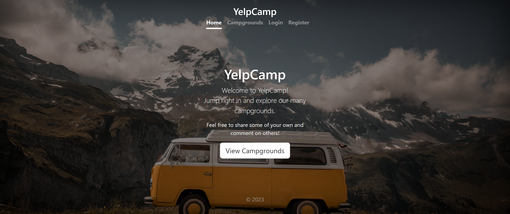
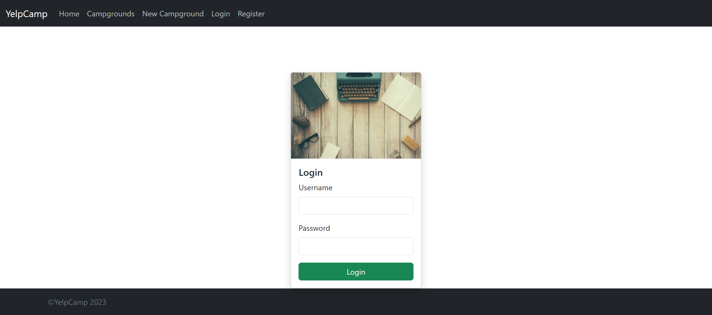
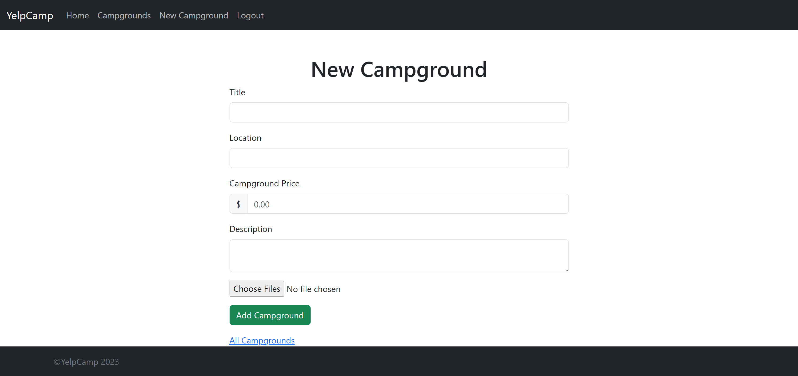
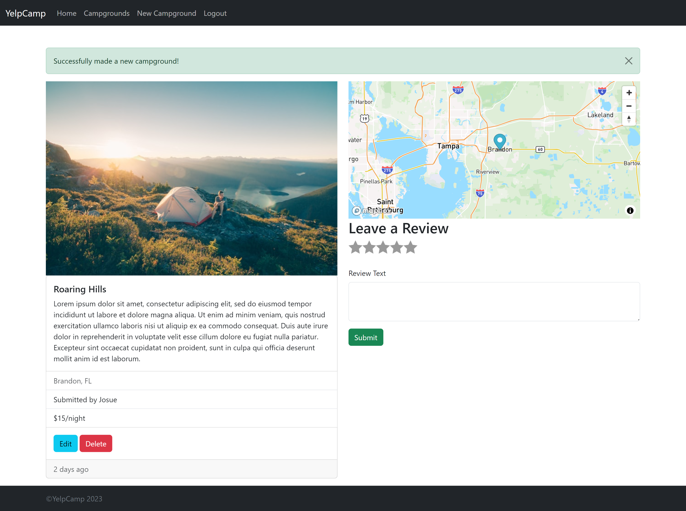

# YelpCamp 2023

YelpCamp was the capstone project from Colt Steele's "Web Developer Bootcamp 2023" from Udemy. It was a combination of all the topics that was covered through the course, alongside some additional features. These topics include the basic HTML, CSS, JavaScript and Bootstrap for the frontend, meanwhile, Express and MongoDB was used for the backend. This project includes geo-location, databases, authentication, authorization, sanitization, etc through the means of mongoose, ejs, passport, multer, joi, helmet, etc.

During my time with this course, I learned a great deal about the full-stack experience.

## Landing Page

## Login Page

## New Campground

## Added Campground

